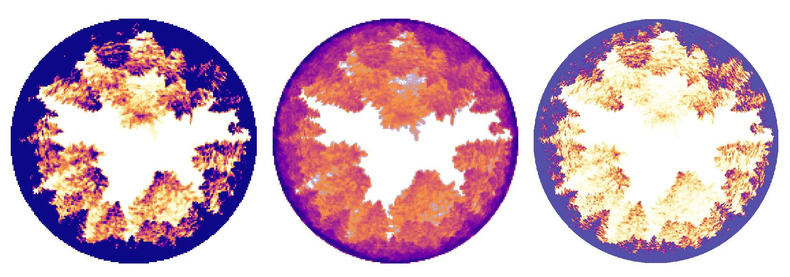
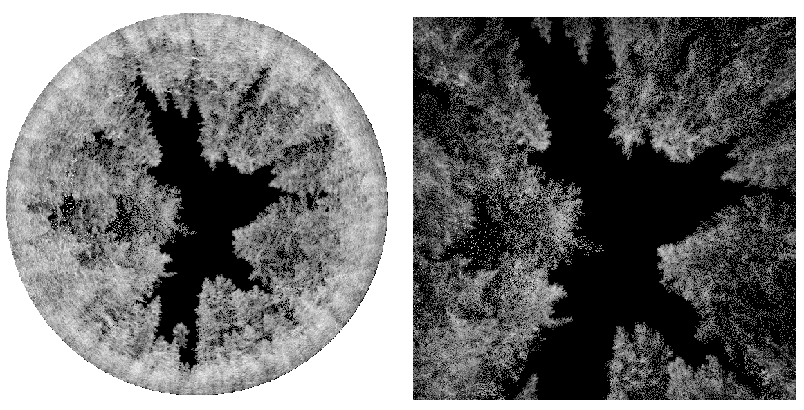

# lasPhotoCamSIM

Provides a simulated image as if it was taken using a camera inside a point cloud. One or several camera locations can be provided using a text file. How much light arrives to the lens is calculated by projecting points on a grid with four mathematical hemispherical lens models: equiangular, equidistant, stereographic,  orthographic and rectilinear(perspective). 

Figure 1. Example over a UAV lidar flight with 5000 points per square meter.

See   [ouput examples](#ouput-examples)  at the bottom of this page .

 

## Installation instruction

### Install

Download the compiled executable lasPhotoCamSIM (linux) or lasPhotoCamSIM.exe (Windows 64-bit compiled with MingW) and enjoy.

### Compile

To compile from source code clone this directory or download the CPP and HPP files and follow these instructions.

#### LINUX   

 - Download LAStools (https://rapidlasso.com/lastools/)[https://rapidlasso.com/lastools/]. 
 - Compile LAStools/LASlib :
    - go to LAStools directory and create a "build" directory (e.g. mkdir build)
    - cd build
    - cmake ../ (install cmake if you don't have it) 
    - make
 - Compile lasPhotoCamSIM :
    - go to the "example" directory in LASlib (<LAStools install dir>/LASlib/example) and copy/move the lasPhotoCamSIM.cpp and lasPhotoCamSIM.hpp files there.
    - Open "Makefile" file and modify contents: 

*convert*          

  _all: lasexample lasexample_write_only lasexample_add_rgb lasexample_simple_classification lasexample_write_only_full_waveform lasexample_write_only_with_extra_bytes_

*to *

  _all: lasexample lasPhotoCamSIM lasexample_write_only lasexample_add_rgb lasexample_simple_classification lasexample_write_only_full_waveform lasexample_write_only_with_extra_bytes_

*and right after add:*

_lasPhotoCamSIM: lasPhotoCamSIM.o_   
      	_${LINKER} ${BITS} ${COPTS} lasPhotoCamSIM.o -llas   -o $@ ${LIBS} ${LASLIBS} $(INCLUDE) $(LASINCLUDE)_

You should be able then to run successfully the command **"make lasPhotoCamSIM"** in the directory and this creates the executable.

### WINDOWS

Use  the MingW compiler chain and follow the steps above, like for linux platforms.

## Usage and description

This tools basically estimates how much light arrives at a certain spot/plot., or how much open skype (aka gap-fraction in forests), or complementary canopy cover ratio, is present at a certain spot. User provides a CSV file with a list of coordinates that correspond to camera positions, height of camera position,  and the tool reprojects the  points from the point cloud to spherical coordinates with respect to a hemispherical dome around the camera,  and figures how much obstruction they create, by testing 1° azimuth x 0.5° zenith sectors, rays that are traced between camera center and points.   

### PARAMETERS

**-loc \<file path\>**: is the path to a CSV file - with header - with the following information:  
 - X Y and Z: coordinates of camera locations (mandatory);  
 - pitch, yaw, roll: orientation of camera; (see **-ori** for more info.) This overrides the -ori command-line parameters if present.   
 - proj: also overrides the **-proj** parameter (see **-proj** for more info.). I.e. you can set for each camera the lens projections to use.
 - orast: also overrides the **-orast** parameter (see **-orast** for more info.) - each camera can project to a specific size of grid - for now only square grids are supported.  
 - other columns can be present and will be saved in output. Comma, tab, pipe, space, column and semi-column characters are accepted as column separators. If you don't care about camera Z coordinate (e.g. if your cloud is normalized to ground) and want a fixed value, you can put '0' for the third column and fix the value using -zCam

Example 1: **-loc cameras.csv** cameras.csv with the following contents:   
  
    X|Y|Z
    279890|5718602|0
    279955|5718681|0
    279880|5718759|0
    279963|5718737|0
    283261|5718290|0

After running, the ouput will create a file in the same directory **cameras.csv.out** with the following contents:
  
    X|Y|Z|GapFraction
    279890|5718602|0|32.4
    279955|5718681|0|72.4
    279880|5718759|0|12.45
    279963|5718737|0|36.8
    283261|5718290|0|12.4

Example 2: **-loc cameras.csv** cameras.csv with orientation , lens projection, setting output grid size to 1000x1000 pixels:   
  
    X|Y|Z|pitch|yaw|roll|proj|orast
    279890|5718602|0|45.0|0.0|0.0|eqa|1000
    279955|5718681|0|45.0|90.0|0.0|eqa|1000
    279880|5718759|0|45.0|180.0|0.0|eqa|1000
    279963|5718737|0|45.0|270.0|0.0|eqa|1000
    283261|5718290|0|75.0|0.0|0.0|eqa|1000

After running, the ouput will create a file in the same directory **cameras.csv.out** with appended gap fraction values and ESRI ASCII grids with 1000x1000 pixels:
 

 
**-orast: \<pixel size of square grid\>:** *default=180*  exports reprojected shperical coordinates to a planar grid ESRI GRID ASCII format. Pixels represent the point counts.  The cell values are the counts of points, scaled if one of  *-log* or *-db* flags is  provided. The name of the output files will be: Plot_\<Number in 00X format\>\<-log or -db if trasformation was used\>\<-ort, -eqd -eqa -str depending on the projection chosen\>.asc 

**-ori \<0.0 180.0 0.0\>**- camera orientation, pitch, yaw and roll/tilt angles in degrees (optional). If not set, it implies an upward looking camera. E.g. 0.0 180.0 0.0 means a camera oriented towards the horizon looking south, not tilted.
NB upward looking camera has pitch at 90 degrees corresponds to 0 degrees zenith angle - dont confuse the -zenCut value, that is in zenith angle. 

**-maxdist: \<distance in meters\>**: *default=1000.0* - any points falling outside this distance from the camera center will be ignored.   

**-log**: converts pixel values, which represent point counts, to log10 scale (-orast must be also present) - formula is log10(pixelvalue+1). 
Cells with no pixels (value=0) are thus given log(1) and have value 0 also after transformation.  This can be helpful as high zenith angles will obviously intersect a very high number of poitnts. Log-transformation can scale to better visualize results. 

**-db**: converts to dB (decibel values) with -10*log10(pixelvalue/maxPixelValue). The pixel with most point counts will have value 1, the other will have positive values.  

**-weight \<power value\>**: *default=0.0* power of inverse distance weight. Each point that intersects a 1°x1° sector in the dome will be positioned at a certain distance that can be used to weight the value of the point. No weight=each point weights 1, i.e. if 10 points are in the sector, that sector will be occluded by 10 points. If weight=2 (-weight 2.0) is provided, each point will add a value of 1.0 * 1.0/pow(distance, 2.0) to the total.  Default value is 0 because no weight is applied. 

**-zCam \<height value in meters\>**: *default=1.3m* \n\t- height of camera - NB this is in absolute height with respect to the point cloud, so if your point cloud is normalized (e.g. a canopy height model) then 1.3m will be 1.3m from the ground. 

**-zenCut \<Zenith angle in degrees\>**: *default=89* \n\t- At zero (0) degrees zenith angle the direction points directly upwards, at 90 degrees it points at the horizong.  Thus 90 degrees zenith angle potentially will intercept  million of points: a smaller Zenith angle will ignore points lower than that angle (e.g. setting at 85 degrees will cut-off points that are below 5° from the horizon) . 

### OUTPUT

  1. a CSV file with the file name  appended with  *.out* and file contents of original camera locations file with appended column with gap fraction values.
  2. If *-orast*  is set, one ESRI GRID ASCII (.asc) text file that can be loaded in a gis software. One grid file per plot, named <plot. Center of grid is geolocated at camera position, but of course the size is not scaled.
 
**Examples** 

    lasPhotoCamSIM -i /archivio/LAS/las_normalized/forest.laz -loc cameras.csv -verbose
    
Will read all points from forest.laz and camera locations at cameras.csv file in current directory, providing verbose messages.

    lasPhotoCamSIM -i /archivio/LAS/las_normalized/*.laz -loc camera.csv -log -weight 2.0 -verbose

Will read points in all LAZ files in folder /archivio/LAS/las_normalized/   and camera locations at cameras.csv file with verbose messages, and count points in falling in spherical sectors applying an inverse distance weight that is a power of 2. E.g. a point that is at distance X will count 1/X^2. **A 5 cm minimum distance is applyed** to avoid overflow of value if by chance a point is at 0.0m distance - this is reasonable as when camera is positioned, the operator will make sure that there not an obstruction right on the same position as the camera (e.g. right under a leaf).
 

    lasPhotoCamSIM -i /archivio/LAS/las_normalized/*.laz -loc camera.csv -log -orast -weight 2.0 -verbose

Like above but will also create output grids in ESRI GRID ASCII format.
 

### Canopy and vegetation
   
Using a **normalized** point cloud is more straight forward, if you want to focus on canopy light transmission.

## Acknowledgements

This tool was created in the context of two projects, 

CONAF - Postulación Fondo de Investigación del Bosque Nativo Title: Indicadores fenológicos y estructurales de alteración de hábitat en bosques de araucaria. Part of the activities was to assess estimations using real hemispherical photography, canopy-scope and photogrammetric point clouds. See paper....

VARCITIES - visionary solutions... In this context the light transmission in a garden is estimated to assess, with other variables, which areas are most suited for wellness of visitors. 

## Contacts   

Contact <a href=mailto:francesco.pirotti@unipd.it>AUTHOR</a> or visit  [https://www.cirgeo.unipd.it](https://www.cirgeo.unipd.it)
for more info and links to social-media, [Facebook](https://www.facebook.com/cirgeo.unipd) or [Instagram](https://www.instagram.com/cirgeo.unipd/). 

## Output examples

Figure 1. Fisheye vs normal perspective camera over canopies sampled with high density laser scanning.
